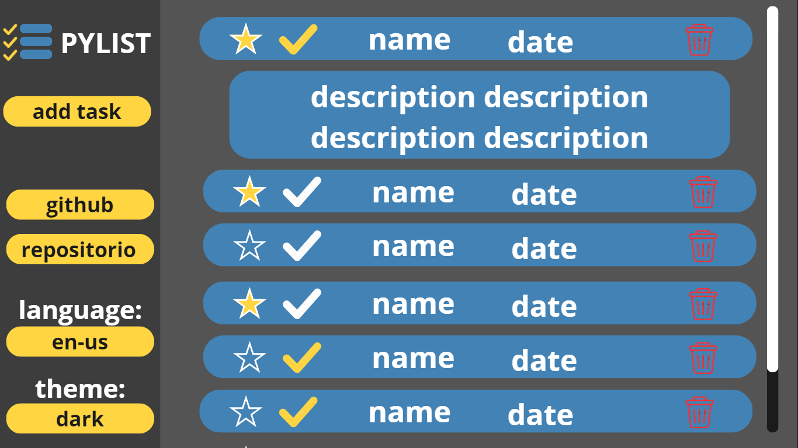
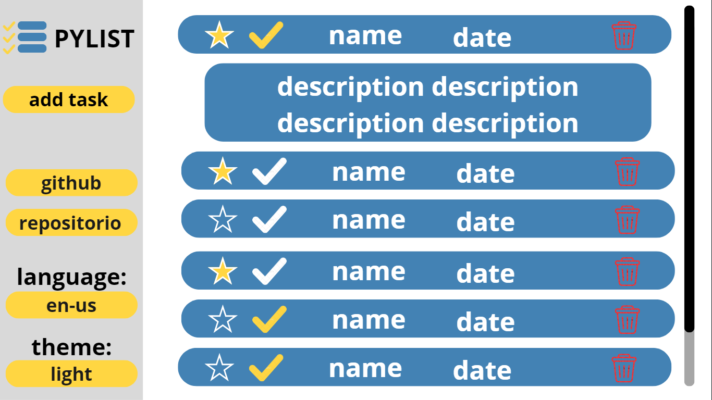

# PYLIST
Um programa genérico de lista de tarefas ou, como é mais conhecido, um "task-list". Como esse projeto é normalmente muito simples, eu quis complicar um tanto ele. Para isso, esse projeto usará SQLite para salvar as tasks (tarefas) e ainda terá suporte para português e inglês.

## Objetivo
Tenho como objetivo "provar" que eu sei programar em python e que sei usar SQLite. Além de desenvolver melhor a minha habilidade de trabalhar em um projeto grande como esse.

## Planejamento.txt
escrevir em inglês porque estou treinando ele, o inglês no caso (.-.)

	files
	 config.py - all constants, paths e etc.
   build.py - create build
	 __main__.py - main window
	 ./assests - place of the images
	 ./data/(languages, tasks).db - your tasks in sqlite
	 ./_class/database.py - class to facilitate the task manager
	 ./components/(btn, task, etc).py - class to facilitate the make gui

	template database tasks 
	 title: TEXT
	 description: TEXT
	 priority: BLOB
	 time: REAL

	obs
	 with "SELECT DATETIME('now')" i could current date and time

	 to stored date and time in a field "REAL"
	  isotime = "YYYY-MM-DD HH:mm"
	  time_number = julianday(isotime)
	  time_str = datetime(time_number)

## Imagens Conceito
Imagens conceitos são usadas para criar um previou que como o projeto irá se parecer, facilitado na hora de faze-lo. Inclusive, as imagens foram feitas no canva. Qual importancia dessa ultima frase? Ainda estou procurando.

### Dark mode

### Light mode
